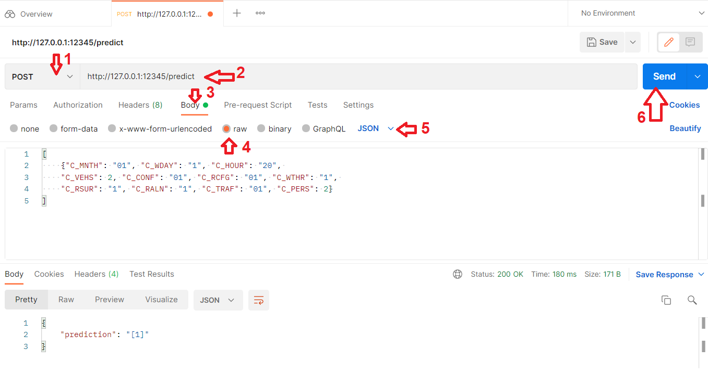

# Canadian Car Accidents: API
API para utilizar el modelo de predicción de la mortalidad de un accidente, basado en el modelo creado 
en el trabajo de *Canadian Car Accidents: Modelo* (https://github.com/carviagu/canadian_car_accidents)

<br> 

---

Autores / Authors:

* Álvaro Serrano del Rincón (a.serranodelrincon@cunef.edu). Repo: https://github.com/aserincon/canadian_car_accidents_api
* Carlos Viñals Guitart (carlos.vinals@cunef.edu). Repo: https://github.com/carviagu/canadian_car_accidents_api

---
<br>
<br> 

## Descripción del repositorio

* **api**: Carpeta principal de la API.
  * **api.py** Script principal de la API. Aquí se encuentran los controladores de las instrucciones CRUD y las funciones principales de la misma.
  * **modules** Directorio con scripts con funcionalidades de la API. 
  * **model** Directorio donde se encuentra el modelo XGBoost creado en el proyecto de modelado y que utiliza la API para realizar sus predicciones
  * **data** Directorio con los datos utilizados por la API en su funcionamiento.
  * **Dockerfile** Script para generar la imagen de la API y su contenedor. 
* **reports**: Informe del trabajo y creación de la API.
* **html**: Informe del trabajo y creación de la API (html).
* **images**: Recursos útiles.

## Instrucciones de funcionamiento de la API

### Generar el contenedor docker
La api ha sido preparada para funcionar dentro de un contenedor docker de tal forma que podamos evitar
problemas de compatibilidas. Sin embargo puedes ejecutarla directamente en tu sistema y saltarte este paso, asegurate 
de que tienes instalados en el entorno donde ejecutes la API los paquetes indicados en  [requirements.txt](api/requirements.txt).

Recuerda que debes de tener instalado [Docker](https://www.docker.com/) previo a iniciar este paso.

1. En una terminal dentro de la carpeta api del repositorio crea la imagen del docker:

```shell
docker build -t canadian_api .
```
2. Una vez creada la imagen, creamos el contenedor mediante el siguiente comando:

```shell
docker run -it -p 5000:5000 canadian_api bash
```
Con esto se creará tu contenedor y ya podrás ejecutar la API. 

### Poner en funcionamiento la API 
Para poner en marcha el servidor de la API:
1. Si ejecutas la API en tu sistema:
   * Abrir una terminal de ```conda``` con el entorno correspondiente en el directorio del proyecto.
  
   * Ejecutar al siguiente instrucción:
   
```shell
python api.py
```
2. Si ejecutas la API dentro del contenedor:
   * Ejecutar al siguiente instrucción en la terminal del contenedor que se habrá abierto:
    
```shell
python3 api.py 5000 0.0.0.0
```

Si todo ha ido bien observaremos esto en la terminal:
    
```shell
* Serving Flask app "api" (lazy loading)
 * Environment: production
   WARNING: This is a development server. Do not use it in a production deployment.
   Use a production WSGI server instead.
 * Debug mode: on
 * Restarting with stat
Model loaded
 * Debugger is active!
 * Debugger PIN: 182-428-679
 * Running on http://127.0.0.1:5000/ (Press CTRL+C to quit)

```

### Usar la API mediante ```Postman```:

* Accedemos a [Postman](https://www.postman.com/) y abrimos una nueva pestaña para usar una API.
* Indicamos que la función a usar es POST (1).
* Escribimos la dirección de la API con la función predict (2): ```http://localhost:5000/predict```.
* Marcamos que vamos a darle los datos en el cuerpo de la llamada ```Body``` (3).
* Marcamos la opción ```raw``` (4).
* Indicamos que está en formato JSON (5).
* Escribimos los datos de un accidente:
```json
[
    {"C_MNTH": "01", "C_WDAY": "1", "C_HOUR": "20", 
    "C_VEHS": 2, "C_CONF": "01", "C_RCFG": "01", "C_WTHR": "1", 
    "C_RSUR": "1", "C_RALN": "1", "C_TRAF": "01", "C_PERS": 2}
]
```
* Enviamos la solicitud a la API (6).





Si todo ha ido bien observaremos la predicción devuelta por la API abajo de la pantalla. 


## Report (Memoria)
Para entender todas las características de la API y como se ha realizado su diseño y creación se puede ver la memoria
de trabajo redactada:
  * Versión Markdown: [memoria.md](reports/memoria.md)
  * Versión HTML: [memoria.html](html/memoria.html)
